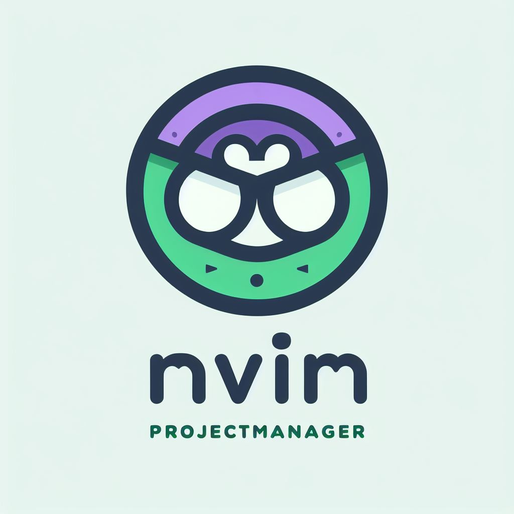
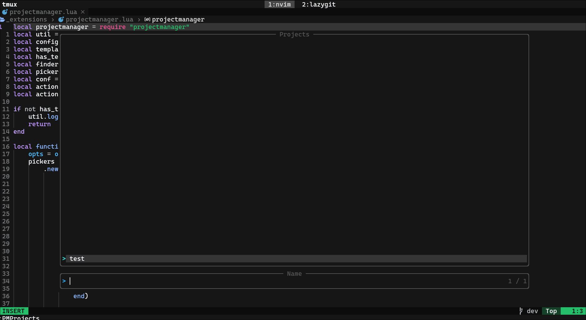

<div align="center">
  <h1>nvim-projectmanager</h1>
  
  <p>If you have any Feature suggsetions pls open a issue, i dont rly know what to add anymore</p>
</div>

## Compatabilty


## Features

- Create, open, and manage projects

- Load templates

## Usage

- ### PMCreateProject

  Creates a new project in the default_project_dir and changes the working directory, you can enter a full path to create a Project outside of the default_project_dir.

- ### PMOpenProject
    
  opens a new project (full path needed)

- ### PMProjects

  Opens a telescope window with all projects.

  

- ### PMTemplates

  Opens a telescope window with all templates.
  You can get some templates from my [templates](https://github.com/raphaelladinig/templates), or make your own.

- ### PMClearRecentProjects

  Clears the recent projects list.

## Installation

### Lazy

```lua
{
  "raphaelladinig/nvim-projectmanager",
  dependencies = {
      "nvim-telescope/telescope.nvim",
  },
  config = function()
      require("projectmanager").setup({
          default_project_dir = "/home/username/Projects",
          template_dir = "/home/username/Projects/templates",
      })
      require("telescope").load_extension("projectmanager")
  end,
}
```

## Config

You need to set default_project_dir and template_dir in the setup function, or it won't work.

```lua
{
    default_project_dir = nil, -- absolute Path !!!
    template_dir = nil, -- absolute Path !!!
    number_of_recent_projects = 5,
    keybinds = { -- Telescope binds
        addToPinnedProjects = "<c-p>",
        removeFromPinnedProjects = "<c-r>",
    },
}
```

## API

- ### getPinnedProjects()

  Returns a list of the pinned projects.

- ### getRecentProjects()

  Returns a list of the most recent projects.

- ### getTemplates()

  Returns a list of all templates.

## ToDo

- Write proper doc and fix README
